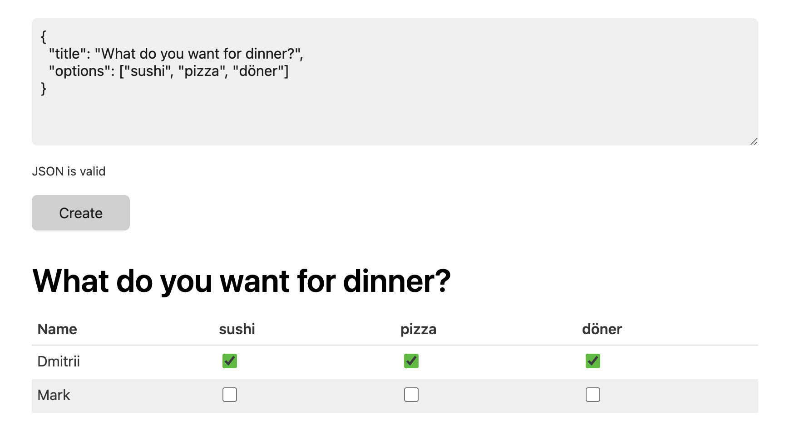

# Sowhenthen

This is a copy (with some adjustments) of [jawanndenn](https://github.com/hartwork/jawanndenn). It is a simple web application to schedule meetings and run polls. Sowhenthen uses [water.css](https://github.com/kognise/water.css) for styling and doesn't have a single html class, hence the simplified interface. Other technologies that are used:

- [Go](https://github.com/golang/go)
- [Chi](https://github.com/go-chi/chi)
- [GoDotEnv](https://github.com/joho/godotenv)
- [Air](https://github.com/cosmtrek/air)
- [JavaScript](https://developer.mozilla.org/en-US/docs/Web/JavaScript)
- [Alpine.js](https://github.com/alpinejs/alpine)
- [MongoDB](https://www.mongodb.com/)

Compared to [jawanndenn](https://github.com/hartwork/jawanndenn), **sowhenthen** only supports 2 fields in the setup JSON:

| Field name | Type     | Description                                                                         |
| ---------- | -------- | ----------------------------------------------------------------------------------- |
| title      | string   | The title of the poll. Only supports plaintext.                                     |
| options    | string[] | The voting options. Each voter can choose anywhere between 0 and all of the options |

## Screenshots

## 

